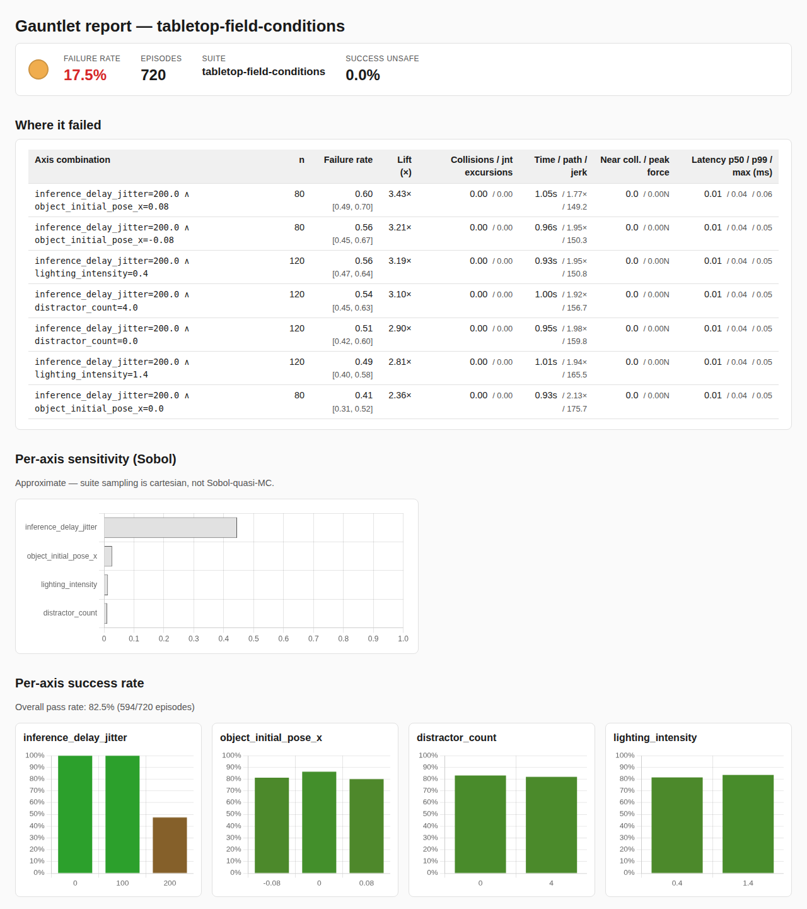

# Field-condition robustness: a worked example

Lab evaluations of a manipulation policy usually hold everything a field
robot cannot control fixed: compute latency, where the target sits,
what else is in the workspace, the light. This walkthrough uses
[`examples/suites/tabletop-field-conditions.yaml`](../examples/suites/tabletop-field-conditions.yaml)
to show how a checkpoint regression that looks like "a few points worse
on average" is really "lost all of its latency margin".

The env is still the MuJoCo tabletop. Each axis is a stand-in for a
field condition, not a model of one:

| Axis | Values | Field condition it stands in for |
|------|--------|----------------------------------|
| `inference_delay_jitter` | 0, 100, 200 ms | Edge-compute lag on an embedded controller. At the env's 50 ms control period the policy acts on 0-, 2- or 4-step-stale commands. |
| `object_initial_pose_x` | −8, 0, +8 cm | Target placement variance relative to where the policy expects it. |
| `distractor_count` | 0, 4 | Clutter in the workspace. |
| `lighting_intensity` | 0.4, 1.4 | Low vs. harsh light. Only image-conditioned policies see it, so a state-based policy should be flat here. That makes it a useful control. |

36 cells × 20 episodes = 720 rollouts per policy, fully seeded.

## Reproduce

```bash
python scripts/generate_reference_benchmark.py \
  --suite examples/suites/tabletop-field-conditions.yaml \
  --out out/field/
```

This runs two policies from the reference benchmark (about 15 s total on
a laptop) and writes `baseline/report.html`, `regressed/report.html`,
`compare.json` and `diff.txt`:

- **baseline**: `ClosedLoopReachPolicy`, a phase-machine controller
  reading `cube_pos` / `ee_pos` / `target_pos`.
- **regressed**: the same controller with σ = 6 cm noise on those
  observations. It stands in for a fine-tune whose state estimate got
  worse while the control law stayed the same.

## What the reports show



Per-axis success rate (each bucket pools 240 episodes):

| Axis value | Baseline | Regressed |
|------------|---------:|----------:|
| delay 0 ms | 100% | 67% |
| delay 100 ms | 100% | 40% |
| delay 200 ms | 47% | 23% |
| pose −8 / 0 / +8 cm | 81 / 86 / 80% | 40 / 45 / 43% |
| distractors 0 / 4 | 83 / 82% | 42 / 44% |
| lighting 0.4 / 1.4 | 81 / 84% | 43 / 43% |
| **overall** | **82.5%** | **43.1%** |

Three things stand out that the overall number hides:

1. **The baseline has a latency cliff, not a slope.** It is perfect up to
   100 ms and drops to 47% at 200 ms. Every row of its failure-cluster
   table involves `inference_delay_jitter=200`, at about 3× the baseline
   failure rate. Sensitivity analysis agrees: total-order index 0.44
   for delay versus ≤ 0.03 for every other axis.
2. **The regression ate the margin.** The regressed checkpoint already
   loses 60% of rollouts at 100 ms, a delay the baseline handled
   perfectly. `gauntlet diff` flags the 100 ms cells as the largest
   per-cell flips (100% → 15% in the worst cell; 12 of the 20 flagged cells sit at 100 ms). A latency budget
   that was safe for the old checkpoint is not safe for the new one,
   and a single mean of 82% → 43% does not tell you that.
3. **Lighting is flat for both.** As expected for a policy that never
   looks at pixels. If an image-conditioned policy showed the same
   flatness, that would be worth checking too: it would mean the vision
   pathway is not doing the work. Clutter is flat for a related reason:
   the four enabled distractor slots sit at the table edge (±0.35 m),
   outside this controller's reach path. A policy that sweeps wider, or
   a suite that places distractors nearer the target, would see them.

The regressed report has no failure clusters at all. Its failures are
spread evenly across the grid, so no axis combination clears the
cluster-lift threshold. That is a finding in itself: the damage is
global (bad state estimate), not tied to one condition.

## Extending it

- **Image-conditioned policies.** Add `camera_extrinsics` (mount
  vibration / drift) and the sensor axes `image_attack` (sensor noise,
  JPEG artefacts, occlusion patch, camera dropout) and
  `color_shift_synthetic` (hue / saturation casts). Declaring either in
  the suite is enough: `gauntlet run` builds the env with rendering on
  and applies the wrappers. See
  [`examples/suites/tabletop-sensor-language.yaml`](../examples/suites/tabletop-sensor-language.yaml).
- **Statistical power.** `gauntlet suite plan
  examples/suites/tabletop-field-conditions.yaml` reports the
  per-cell episode counts needed to detect a given success-rate gap.
  20 per cell gives ±0.2 Wilson CIs per cell. The per-axis numbers above
  pool 240 episodes per bucket and are much tighter.
